# DriveMate - Driving School Management System

A modern, scalable web application built with Next.js 15, TypeScript, and Redux Toolkit for driving school management.

## 🏗️ Feature-Based Architecture Overview

This project follows **Feature-Based Architecture**, where each feature is self-contained with its own components, hooks, state management, and business logic.

### 📊 Feature-Based Architecture Diagram

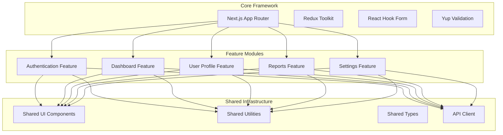

### 🎯 Feature Structure

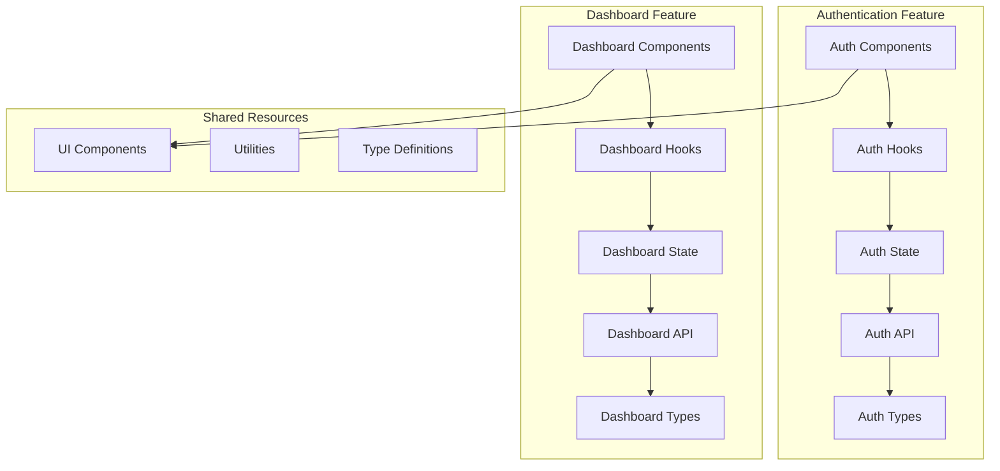

## 🔄 Feature Communication Flow

### 1. **Authentication Feature Flow**

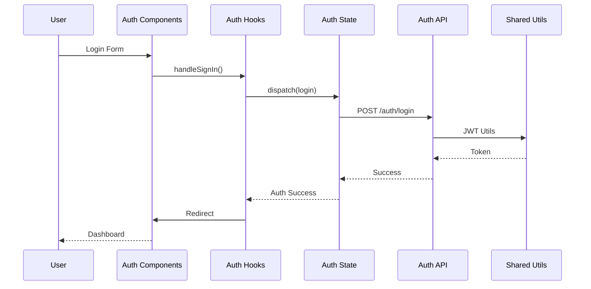

### 2. **Dashboard Feature Flow**

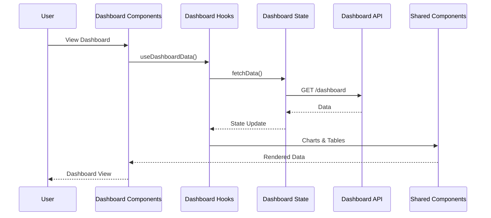

### 3. **Cross-Feature Communication**

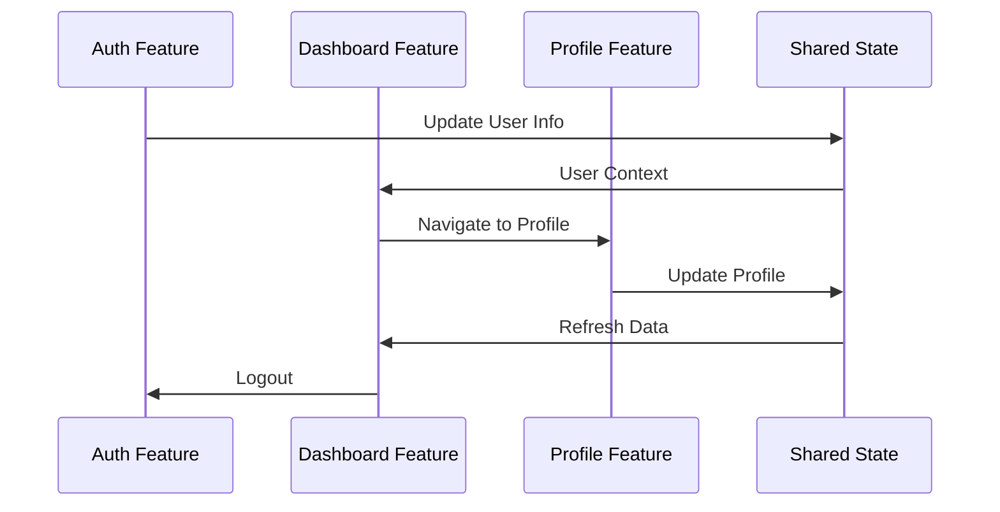

## 🎯 Feature Modules

### **1. Authentication Feature**

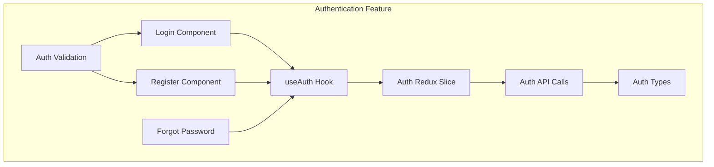

**Responsibilities:**
- ✅ User authentication (login/logout)
- ✅ User registration
- ✅ Password management
- ✅ JWT token handling
- ✅ Role-based access control

### **2. Dashboard Feature**

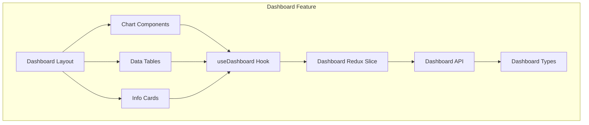

**Responsibilities:**
- ✅ Data visualization
- ✅ Real-time updates
- ✅ Interactive charts
- ✅ Data tables
- ✅ Performance metrics

### **3. User Profile Feature**

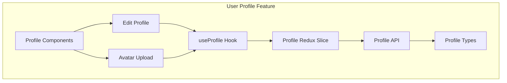

**Responsibilities:**
- ✅ User profile management
- ✅ Profile editing
- ✅ Avatar upload
- ✅ Personal information
- ✅ Account settings

### **4. Reports Feature**

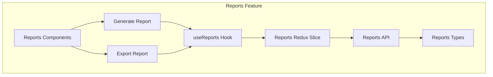

**Responsibilities:**
- ✅ Report generation
- ✅ Data export
- ✅ Report templates
- ✅ Scheduled reports
- ✅ Report history

## 🛠️ Technology Stack

### **Frontend Framework**
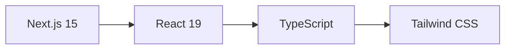

### **State Management**
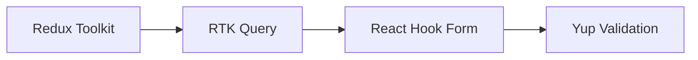

### **UI & Styling**
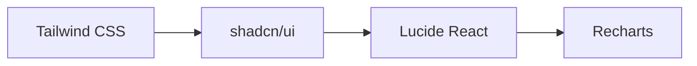

## 📊 Feature Data Flow

### **Feature State Management**

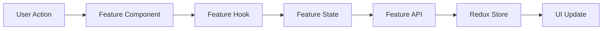

### **Cross-Feature Communication**

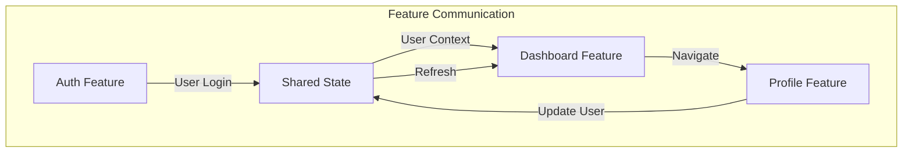

### **Feature Error Handling**

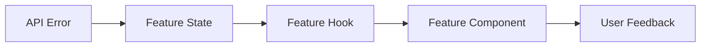

## 🚀 Getting Started

### **Prerequisites**
- Node.js 18+ 
- npm/yarn/pnpm

### **Installation**
```bash
# Clone the repository
git clone <repository-url>
cd webapp

# Install dependencies
npm install

# Start development server
npm run dev
```

### **Environment Variables**
Create a `.env.local` file:
```env
NEXT_PUBLIC_API_URL=your_api_url
NEXT_PUBLIC_APP_NAME=DriveMate
```

### **Available Scripts**
```bash
npm run dev          # Start development server
npm run build        # Build for production
npm run start        # Start production server
npm run lint         # Run ESLint
```

## 🔧 Development Guidelines

### **1. Adding New Features**

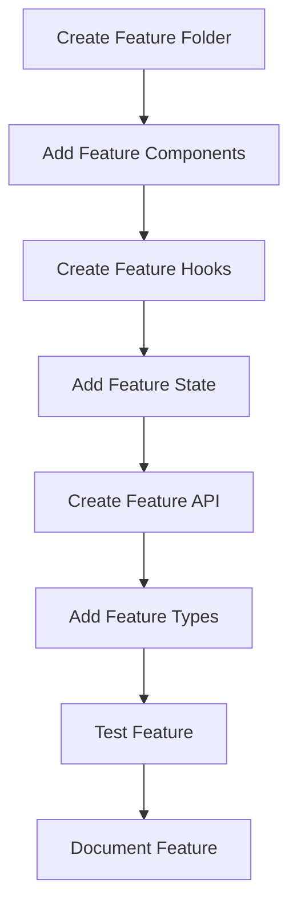

### **2. Feature Structure Template**

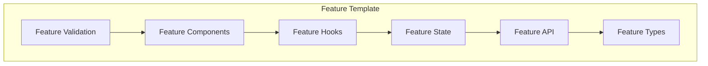

### **3. Feature Communication Pattern**

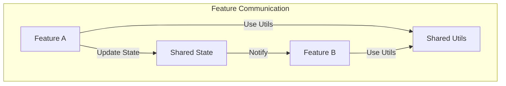

## 🧪 Testing Strategy

### **Feature Testing Pyramid**

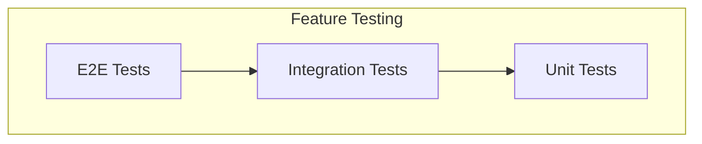

### **Feature Test Coverage**

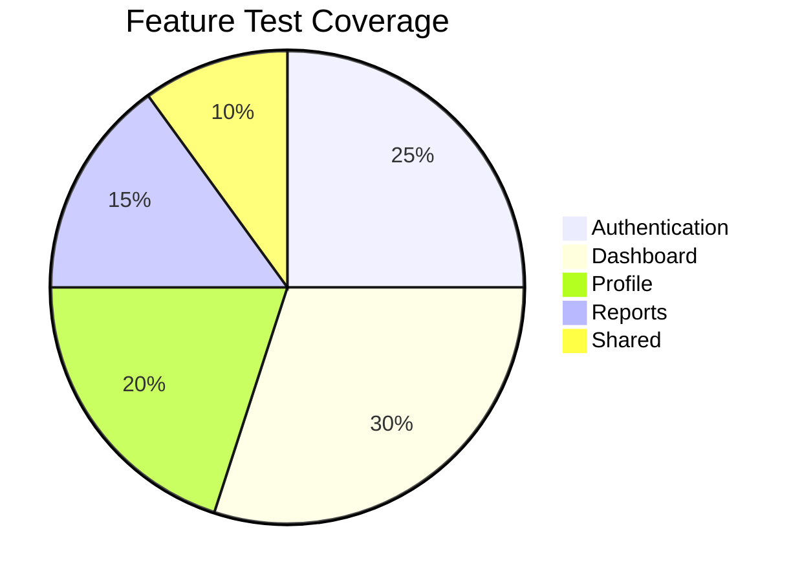

## 📈 Performance Optimization

### **Feature-Based Code Splitting**

```mermaid
graph TB
    subgraph "Code Splitting"
        AuthBundle[Auth Bundle]
        DashboardBundle[Dashboard Bundle]
        ProfileBundle[Profile Bundle]
        ReportsBundle[Reports Bundle]
    end
    
    subgraph "Loading Strategy"
        LazyAuth[Lazy Load Auth]
        LazyDashboard[Lazy Load Dashboard]
        LazyProfile[Lazy Load Profile]
        LazyReports[Lazy Load Reports]
    end
    
    AuthBundle --> LazyAuth
    DashboardBundle --> LazyDashboard
    ProfileBundle --> LazyProfile
    ReportsBundle --> LazyReports
```

### **Feature State Optimization**

```mermaid
graph LR
    Selective[Selective Subscriptions] --> Memo[Memoized Selectors]
    Memo --> Optimistic[Optimistic Updates]
    Optimistic --> Performance[Performance Gain]
```

## 🔒 Security Considerations

### **Feature Security Layers**

```mermaid
graph TB
    subgraph "Feature Security"
        AuthSecurity[Auth Security]
        DataSecurity[Data Security]
        InputSecurity[Input Security]
        APISecurity[API Security]
    end
    
    subgraph "Security Measures"
        JWT[JWT Tokens]
        Validation[Input Validation]
        Encryption[Data Encryption]
        Sanitization[Input Sanitization]
    end
    
    AuthSecurity --> JWT
    DataSecurity --> Encryption
    InputSecurity --> Validation
    APISecurity --> Sanitization
```

## 🚀 Deployment

### **Feature-Based Deployment**

```mermaid
graph LR
    Code[Code Changes] --> Build[Feature Build]
    Build --> Test[Feature Tests]
    Test --> Deploy[Feature Deploy]
    Deploy --> Monitor[Feature Monitor]
```

### **Environment Configuration**

```mermaid
graph TB
    subgraph "Environments"
        Dev[Development]
        Staging[Staging]
        Production[Production]
    end
    
    subgraph "Feature Configuration"
        AuthConfig[Auth Config]
        DashboardConfig[Dashboard Config]
        ProfileConfig[Profile Config]
        ReportsConfig[Reports Config]
    end
    
    Dev --> AuthConfig
    Staging --> DashboardConfig
    Production --> ProfileConfig
    Production --> ReportsConfig
```

## 📝 Contributing

### **Feature Development Workflow**

```mermaid
graph LR
    Feature[Feature Branch] --> Develop[Develop Feature]
    Develop --> Test[Test Feature]
    Test --> Review[Code Review]
    Review --> Merge[Merge Feature]
    Merge --> Deploy[Deploy Feature]
```

### **Feature Quality Gates**

```mermaid
graph TB
    subgraph "Feature Quality"
        Lint[ESLint]
        Type[TypeScript]
        Test[Unit Tests]
        Build[Build Success]
    end
    
    subgraph "Feature Requirements"
        Docs[Documentation]
        Performance[Performance]
        Security[Security]
        Accessibility[Accessibility]
    end
    
    Lint --> Type
    Type --> Test
    Test --> Build
    Build --> Docs
    Docs --> Performance
    Performance --> Security
    Security --> Accessibility
```

## 📄 License

This project is licensed under the MIT License.

---

**DriveMate** - Modern Driving School Management System

*Built with ❤️ using Feature-Based Architecture with Next.js, TypeScript, and Redux Toolkit*
