# DriveMate - Driving School Management System

A modern, scalable web application built with Next.js 15, TypeScript, and Redux Toolkit for driving school management.

## 🏗️ Architecture Overview

This project follows **Feature-Based Architecture**, where each feature is a complete, self-contained module with its own components, logic, and state management.

### 📊 Simple Architecture Diagram

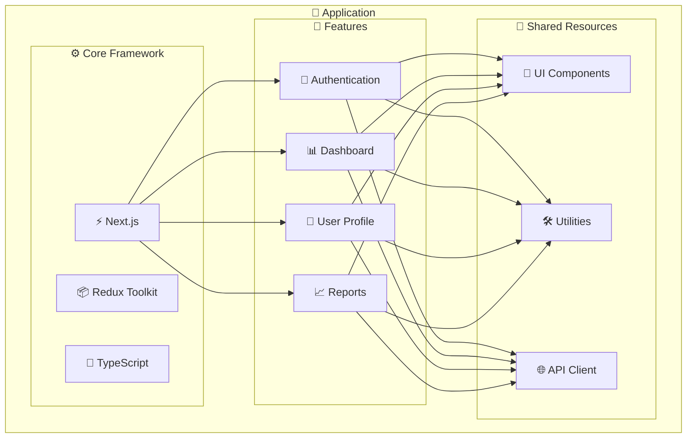

### 🎯 How Features Work

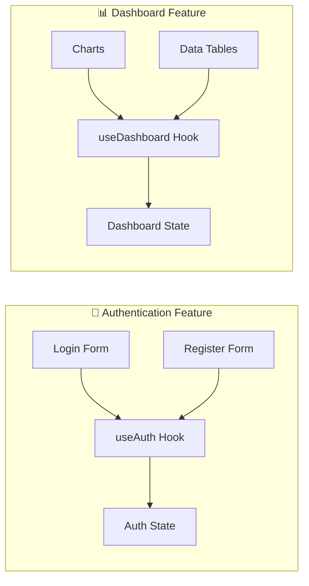

## 🔄 Data Flow

### **Simple Request Flow**

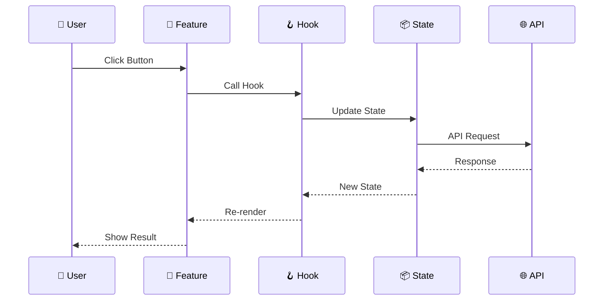

### **Feature Communication**

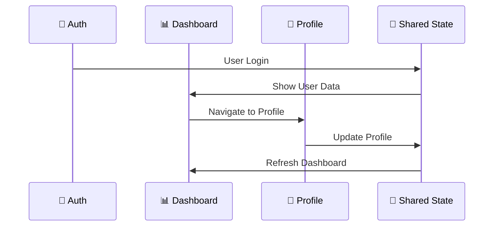

## 🎯 Feature Structure

### **Each Feature Contains:**

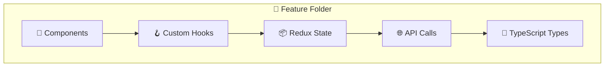

### **Example: Authentication Feature**

```
src/features/auth/
├── components/
│   ├── LoginForm.tsx
│   ├── RegisterForm.tsx
│   └── ForgotPassword.tsx
├── hooks/
│   ├── useAuth.ts
│   ├── useSignIn.ts
│   └── useSignUp.ts
├── state/
│   ├── authSlice.ts
│   └── authThunk.ts
├── api/
│   └── authApi.ts
└── types/
    └── auth.types.ts
```

## 🛠️ Technology Stack

### **Core Technologies**

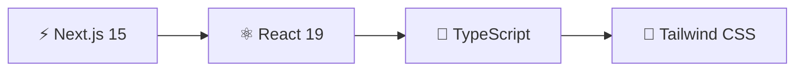

### **State Management**

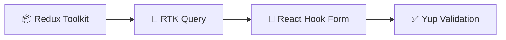

### **UI Components**

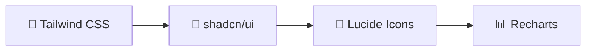

## 🚀 Getting Started

### **Prerequisites**
- Node.js 18+ 
- npm/yarn/pnpm

### **Installation**
```bash
# Clone the repository
git clone <repository-url>
cd webapp

# Install dependencies
npm install

# Start development server
npm run dev
```

### **Environment Variables**
Create a `.env.local` file:
```env
NEXT_PUBLIC_API_URL=your_api_url
NEXT_PUBLIC_APP_NAME=DriveMate
```

### **Available Scripts**
```bash
npm run dev          # Start development server
npm run build        # Build for production
npm run start        # Start production server
npm run lint         # Run ESLint
```

## 🔧 Development Guidelines

### **Adding a New Feature**

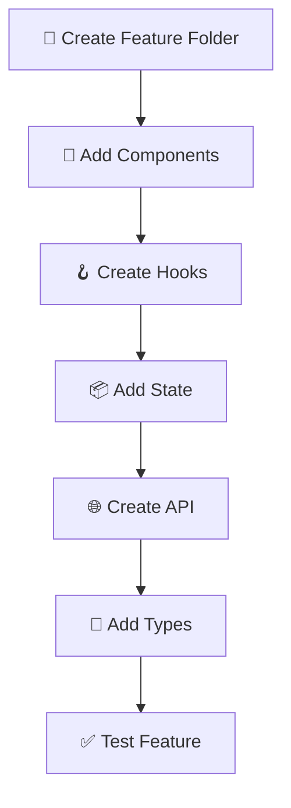

### **Feature Development Steps**

1. **📁 Create Feature Folder**
   ```bash
   src/features/new-feature/
   ```

2. **🎨 Add Components**
   ```typescript
   // src/features/new-feature/components/
   export function NewFeatureComponent() {
     const { data, loading } = useNewFeature();
     return <div>...</div>;
   }
   ```

3. **🪝 Create Hooks**
   ```typescript
   // src/features/new-feature/hooks/
   export const useNewFeature = () => {
     const dispatch = useAppDispatch();
     // Feature logic here
   };
   ```

4. **📦 Add State**
   ```typescript
   // src/features/new-feature/state/
   const newFeatureSlice = createSlice({
     name: 'newFeature',
     initialState,
     reducers: { /* ... */ }
   });
   ```

## 🧪 Testing Strategy

### **Testing Pyramid**

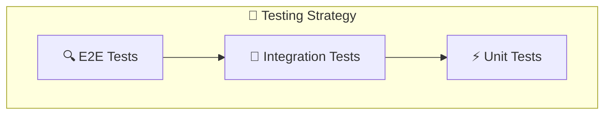

### **Test Coverage by Feature**

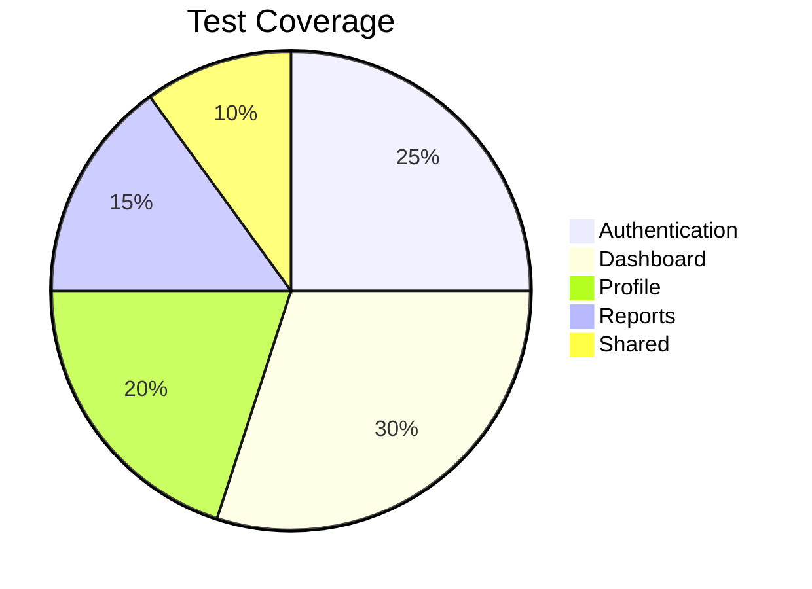

## 📈 Performance Optimization

### **Feature-Based Code Splitting**

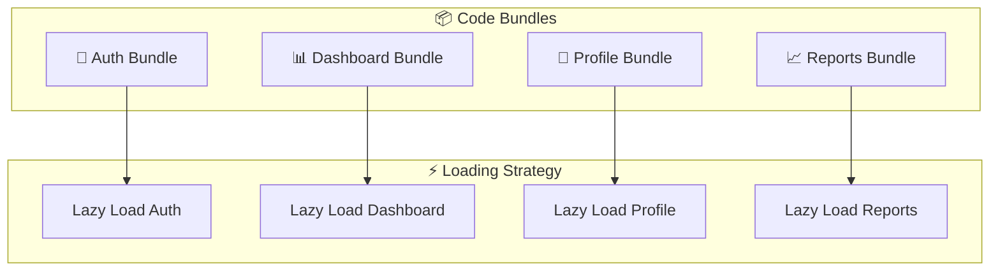

## 🔒 Security

### **Security Layers**

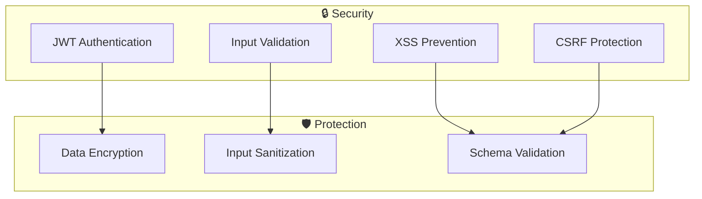

## 🚀 Deployment

### **Deployment Pipeline**

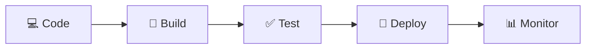

### **Environment Configuration**

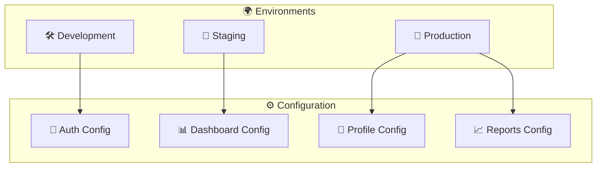

## 📝 Contributing

### **Development Workflow**

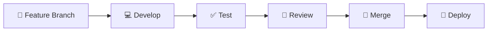

### **Quality Gates**

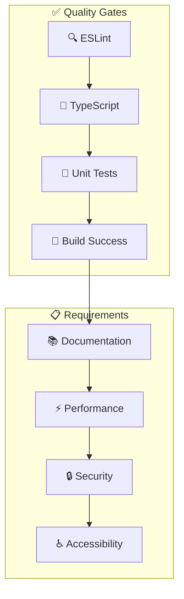

## 📄 License

This project is licensed under the MIT License.

---

**DriveMate** - Modern Driving School Management System

*Built with ❤️ using Feature-Based Architecture with Next.js, TypeScript, and Redux Toolkit*
