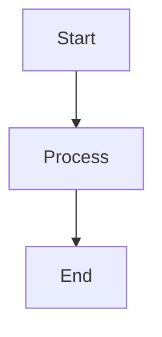
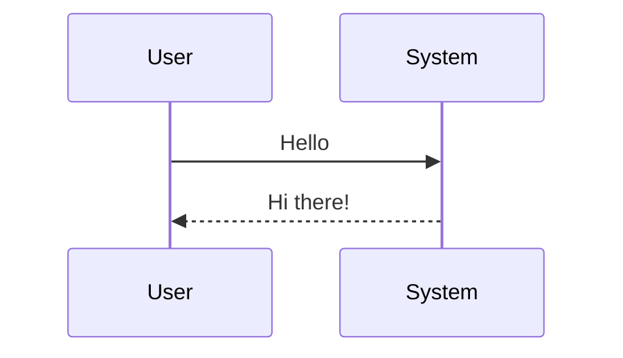
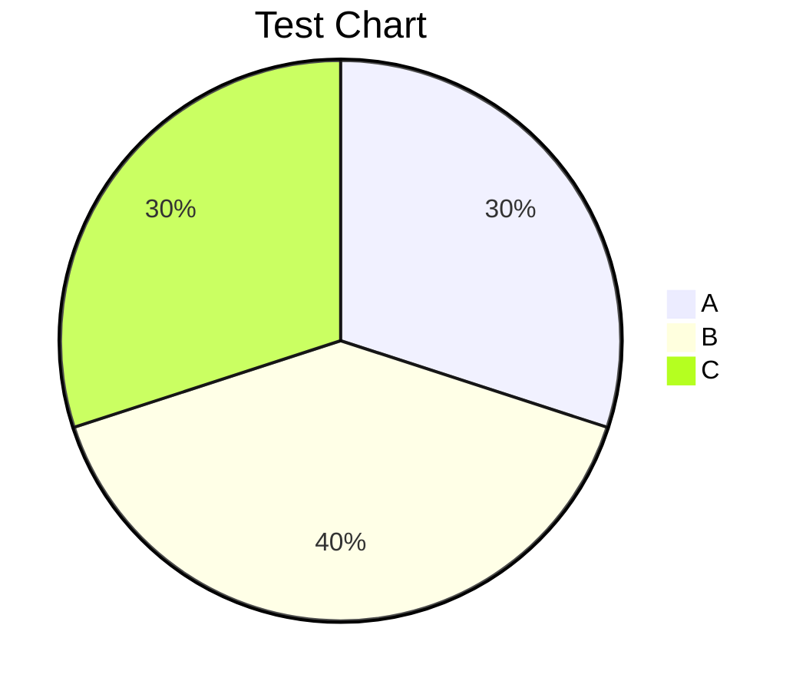

# Test Mermaid Diagrams

## Simple Flow Chart

```mermaid
graph TD
    A[Start] --> B[Process]
    B --> C[End]
```

## Simple Sequence Diagram

```mermaid
sequenceDiagram
    participant A as User
    participant B as System
    A->>B: Hello
    B-->>A: Hi there!
```

## Simple Pie Chart

```mermaid
pie title Test Chart
    "A" : 30
    "B" : 40
    "C" : 30
``` 